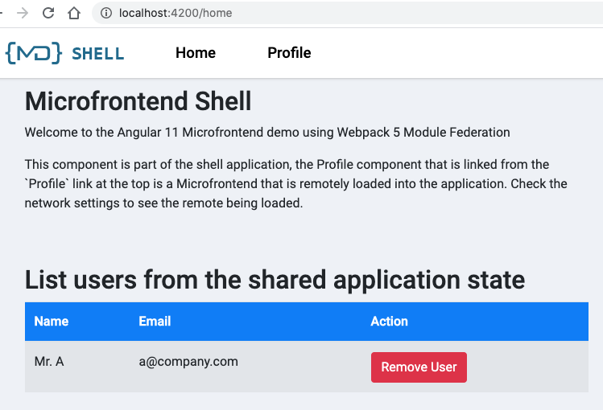
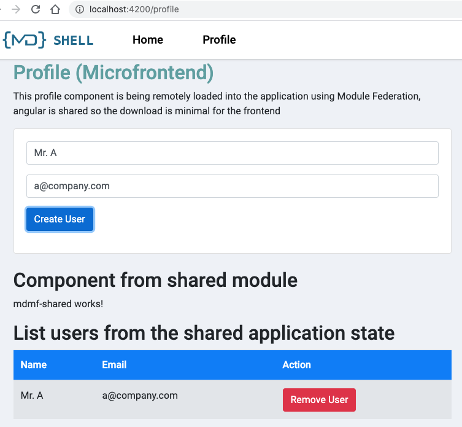

# Microfrontends Angular 11

This project shows an example of using Webpack 5 Module Federation with Angular `11.0.0-rc.2` using shared module and NGXS state management.

- note the use of **yarn**, this is required to override the webpack version for the angular cli
- the project was developed based on the the example `angular11-microfrontends`

- shared library will maintain the application state.
- shell (host) and profile (remote) can access the store, dispatch actions etc.
  - the profile:
    - has a form to create an user, the user info is added stored in the application state (store) which is in the share module `mdmf-shared`
    - show the list of users by selecting them from the common store
  - the shell:
    - show the list of users by selecting them from the common store
  - when an user is added to the store, both shell and profile can see the changes.

## Running the demo

- Install packages: `yarn install`
- Build the shared library `yarn build:shared`
- Start the mdmf-shell: `yarn start:shell`
- Start the Microfrontend: `yarn start:profile`
- Open the shell http://localhost:4200
- Click the profile navigation link to load the remote Microfrontend




# Running Cypress E2E Tests

To run tests in interactive mode, run  `npm run cypress:debug` from the root directory of the project. It will open Cypress Test Runner and allow to run tests in interactive mode. [More info about "How to run tests"](../../cypress/README.md#how-to-run-tests)

To build app and run test in headless mode, run `yarn e2e:ci`. It will build app and run tests for this workspace in headless mode. If tets failed cypress will create `cypress` directory in sample root folder with screenshots and videos.

["Best Practices, Rules amd more interesting information here](../../cypress/README.md)

## Usage

To enable use of Webpack 5 with the angular cli you **must** use **yarn** as your package manager, it allows you to override the webpack dependencies for the CLI.
The package.json contains the following section to override webpack to use version 5 instead of 4:

```json
  "resolutions": {
    "webpack": "5.4.0"
  },
```

## Project Structure

### Shell (mdmf-shell)

The shell project located in: `projects/mdmf-shell` folder, its contains the shell application which is used to load remote Microfrontends using dynamic routing constructed from the Microfrontend array. The list of Microfrontends can be loaded from a config if required, but for the example it is just an hardcoded array.

The share libraries and Angular library (`mdmf-shared`) are configured within the Module Federation config:

```js
  plugins: [
    new ModuleFederationPlugin({
      shared: {
        "@angular/core": { eager: true, singleton: true },
        "@angular/common": { eager: true, singleton: true },
        "@angular/router": { eager: true, singleton: true },
        "@ngxs/store": {singleton: true, eager: true },
        "mdmf-shared": { singleton: true, eager: true },
      },
    }),
  ],
```

The shared module (`MdmfSharedModule`) in the `mdmf-shared` should be imported as normal in the `@NgModule`

### Profile Microfrontend (mdmf-profile)

The profile project located in: `projects/mdmf-profile` contains a profile module with some child routes configured. The profile module is exposed as a remote module within the Module Federation config:

```js
plugins: [
  new ModuleFederationPlugin({
    name: 'profile',
    library: { type: 'var', name: 'profile' },
    filename: 'remoteEntry.js',
    exposes: {
      ProfileModule: './projects/mdmf-profile/src/app/profile/profile.module.ts',
    },
    shared: {
      '@angular/core': { singleton: true, eager: true },
      '@angular/common': { singleton: true, eager: true },
      '@angular/router': { singleton: true, eager: true },
      '@ngxs/store': { singleton: true, eager: true },
      'mdmf-shared': { singleton: true, eager: true },
    },
  }),
];
```

### Shared library (mdmf-shared)

- the shared library is a typical Angular library created by `ng generate library mdmf-shared`

- it uses state management library `ngxs`

  - the dependencies installation
    ```bash
    yarn add @ngxs/store
    ## for loggin and browswer devtools
    yarn add --dev @ngxs/logger-plugin @ngxs/devtools-plugin
    ```
  - need to build the library first before running shell and profile projects
    ```bash
    ng build mdmf-shared
    ```

- it contains the `actions`, application `state` and common `models`
