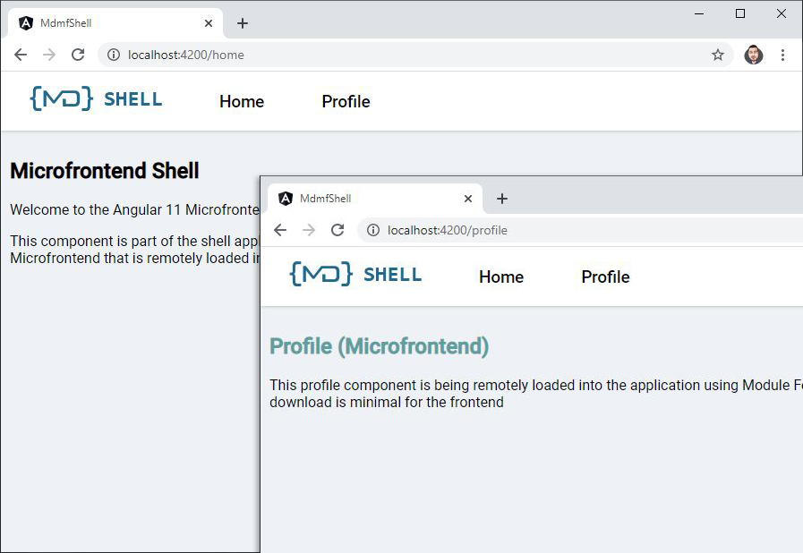

# Microfrontends Angular 12

This project shows an example of using Webpack 5 Module Federation with Angular v11-next.5, note the use of **yarn**, this is required to override the webpack version for the angular cli

## Running the demo

- Install packages: `yarn install`
- Start the mdmf-shell: `ng serve mdmf-shell`
- Start the Microfrontend: `ng serve mdmf-profile`
- Open the shell http://localhost:4200
- Click the profile navigation link to load the remote Microfrontend



# Running Cypress E2E Tests

To run tests in interactive mode, run  `npm run cypress:debug` from the root directory of the project. It will open Cypress Test Runner and allow to run tests in interactive mode. [More info about "How to run tests"](../../cypress/README.md#how-to-run-tests)

To build app and run test in headless mode, run `yarn e2e:ci`. It will build app and run tests for this workspace in headless mode. If tets failed cypress will create `cypress` directory in sample root folder with screenshots and videos.

["Best Practices, Rules amd more interesting information here](../../cypress/README.md)

## Project Structure

### Shell

The shell project located in: `projects/mdmf-shell` folder, its contains the shell application which is used to load remote Microfrontends using dynamic routing constructed from the Microfrontend array. The list of Microfrontends can be loaded from a config if required, but for the example it is just an hardcoded array.

### Profile Microfrontend

The profile project located in: `projects/mdmf-profile` contains a profile module with some child routes configured. The profile module is exposed as a remote module within the Module Federation config:

```js
plugins: [
  new ModuleFederationPlugin({
    name: 'profile',
    library: { type: 'var', name: 'profile' },
    filename: 'remoteEntry.js',
    exposes: {
      ProfileModule: './projects/mdmf-profile/src/app/profile/profile.module.ts',
    },
    shared: ['@angular/core', '@angular/common', '@angular/router'],
  }),
];
```
