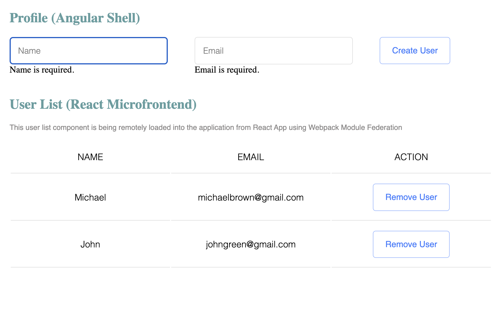

# Module Federation Angular v.14 & React v.18

This project shows an example of using Webpack 5 Module Federation for Angular `14.2.0` app with injected remote React `18.2.0` module. NGXS state management is used in Angular app, state is shared between Angular app and React module. Angular app was developed based on the example `angular11-microfrontends-ngxs`.

## Running the demo

Note the use of **yarn**, this is required to override the webpack version for the angular cli.

For `react-user-list`:
- Install packages: `yarn install`
- Start: `yarn start`(the app uses port 3002)


For `angular-profile`:

- Install packages: `yarn install`
- Start: `yarn start`
- Open the shell http://localhost:4201

Ports could be changed in `webpack.config.js` files located in `react-user-list` and `angular-profile` folders.



# Running Cypress E2E Tests

To run tests in interactive mode, run  `npm run cypress:debug` from the root directory of the project. It will open Cypress Test Runner and allow to run tests in interactive mode. [More info about "How to run tests"](../../cypress/README.md#how-to-run-tests)

To build app and run test in headless mode, run `yarn e2e:ci`. It will build app and run tests for this workspace in headless mode. If tets failed cypress will create `cypress` directory in sample root folder with screenshots and videos.

["Best Practices, Rules amd more interesting information here](../../cypress/README.md)

## Project Structure

- `angular-profile` app maintains the application state
- `angular-profile` app includes a form for adding a new user
- `react-user-list` app contains a table for user list visualizing with Remove button 
- `react-user-list` app calls a function to remove user from the app state after clicking Remove button
- when user is removed from the store, both `angular-profile` app and `react-user-list` app
see the changes.

## Tech details

`react-user-list` uses `ModuleFederationPlugin` to expose `ListUserReactComponent`. The plugin is configured in `webpack.config.js` (see below).  

```js
plugins: [
    new ModuleFederationPlugin({
        name: 'list_user',
        filename: 'remoteEntry.js',
        exposes: {
            './ListUserReactComponent': './src/ListUserReactComponent',
        },
        shared: {
            react: {
                singleton: true,
                requiredVersion: deps.react,
            },
            'react-dom': {
                singleton: true,
                requiredVersion: deps['react-dom'],
            },
        },
    }),
],
```
`angular-profile` contains the shell application which is used to load remote Microfrontends using `loadRemoteModule` function. Appropriate code from `app.module.ts` is listed below.

```js
function initializeApp(): () => void {
  return () => {
    loadRemoteModule({
      remoteEntry: 'http://localhost:3002/remoteEntry.js',
      remoteName: 'list_user',
      exposedModule: './ListUserReactComponent',
    });
  };
}
```

`ModuleFederationPlugin` required in the shell app as well. This configuration listed below.

```js
 plugins: [
    new container.ModuleFederationPlugin({
      name: 'profile',
      filename: 'remoteEntry.js',
      remotes: {
        list_user: `list_user@http://localhost:3002/remoteEntry.js`,
      },
      shared: {
        react: {
          singleton: true,
          requiredVersion: deps.react,
        },
        'react-dom/client': {
          singleton: true,
          requiredVersion: deps['react-dom'],
        },
      },
    }),
  ]
```

React component is injected into `list-user.component.ts`. Here is a component loaded dynamically.

```js
  import('list_user/ListUserReactComponent').then(val => {
        this.store
          .select<IUser[]>(state => state.users.users)
          .subscribe(users => {
            this.root.render(
              React.createElement(val.ListUserReactComponent, {
                users,
                onClick: this.handleClicked,
              }),
            );
          });
      });
```
Please, pay attention that a file like `decl.d.ts` is required into Angular app.

```js
declare module 'list_user/\*';
```

## Reference Points

These references might be usefull in addition to this project in case you are going to implement Angular&React app with Module federation:

1. https://github.com/module-federation/module-federation-examples/tree/master/react-in-vue
2. https://github.com/module-federation/module-federation-examples/tree/master/angular11-microfrontends-ngxs
3. https://thalava.com/how-to-use-react-web-components-in-angular
4. https://medium.com/@zacky_14189/embedding-react-components-in-angular-the-easy-way-60f796b68aef


