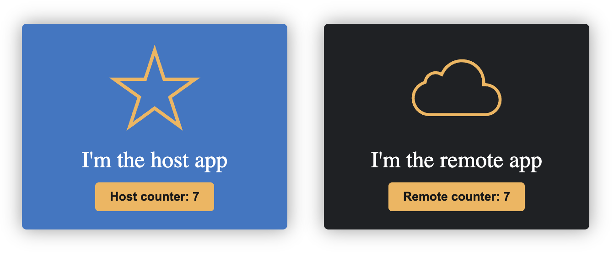

# Vue3 host and remote

## Getting started

From this directory execute:

- npm run install:deps
- npm run preview

Open your browser at http://localhost:5173/ to see the amazing result

The state is shared between applications
