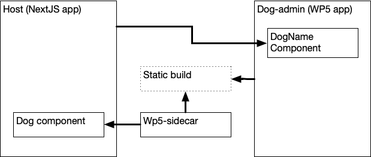
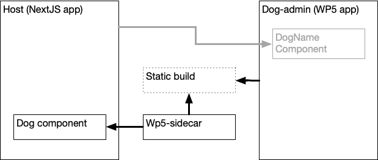
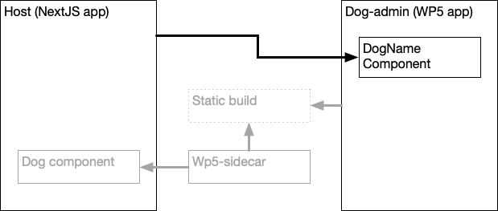

# Using Module Federation in NextJS (before Webpack 5 support)

You can both expose code and consume code with Module Federation using any version of NextJS. Even before there is support for Webpack 5 in NextJS.

The overall architecture looks like this:



# Exposing Components

We use a 'sidecar' application located in a sub-directory within the NextJS application that has Webpack 5 installed. The sidecar then references any shared components relative to the parent directory.



It then creates a `dist` directory containing the Module Federation `remoteEntry.js` and all the associated code. This `dist` directory can then be deployed anywhere as long as it matches the `publicPath` in the `webpack.config.js`.

# Importing Components

NextJS applications can also consume federated modules with ease using some simple shim code.



This is the same with any Webpack 4 based application.

# Migration When NextJS Supports Webpack 5

Once NextJS supports Webpack 5 the sidecar application can be removed, and the shim code used to support importing components can also be removed.

# Running the example

Build and run the code in three seperate terminals:

```shell script
> cd dog-admin
> yarn && yarn start
```

```shell script
> cd host
> yarn && yarn dev
```

```shell script
> cd host/wp5-sidecar
> yarn && yarn build && yarn start
```
