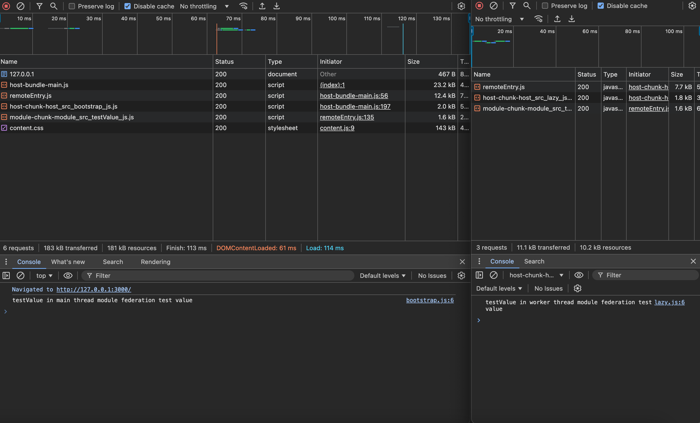

# react-sharedworker
Using Webpack Module Federation in SharedWorker

Federated module (defined under `module` folder), can be consumed by main thread in host application (defined under `host` folder), and it also can be consumed by worker thread.

## How to run

```
yarn
yarn start:module
yarn start:host
```

[Open browser](http://localhost:3000) and observe error in console.



## How to work

1. Use SharedWorker instead of Worker in host application
2. Dynamically import bootstrap file in worker thread
3. Use promise based dynamic remotes `host/webpack.host-config.js`
4. Use multiple entry points in webpack config `module/webpack.module-config.js`