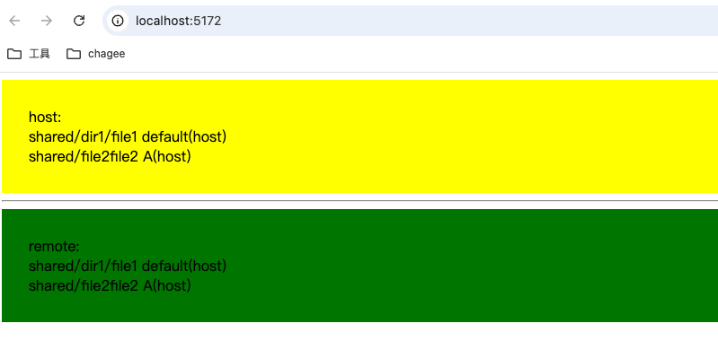

# React host and remote

## Getting started

From this directory execute:

- npm run install:deps
- npm run dev
- npm run preview

### host

http://localhost:5172/

### remote

http://localhost:5176/

Open your browser at http://localhost:5172/ to see the amazing result

