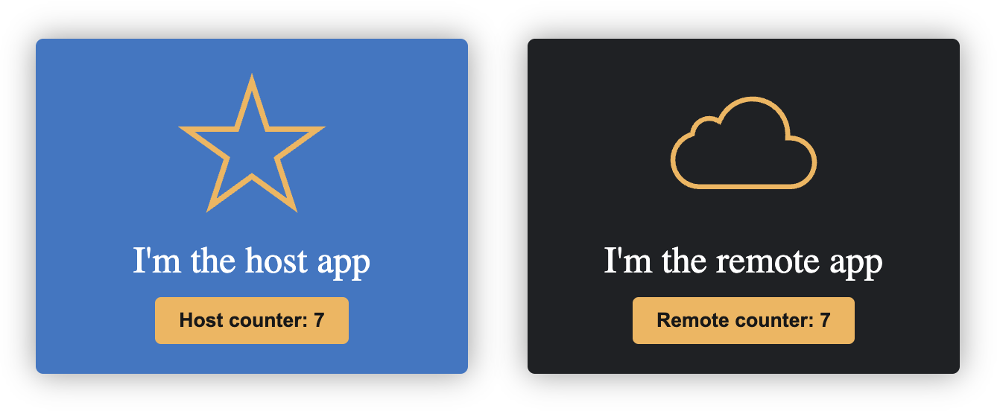

# Vue host and remote

## Getting started

From this directory execute:

- npm run install:deps
- npm run preview:remote
- npm run preview:host (in a different terminal)

Open your browser at http://localhost:4173/ to see the amazing result

The state is shared between applications
